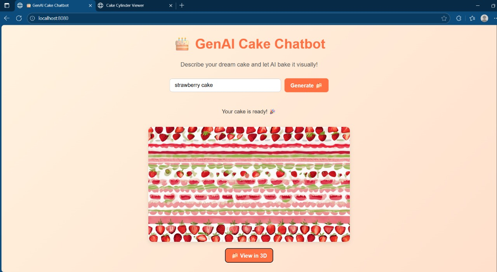
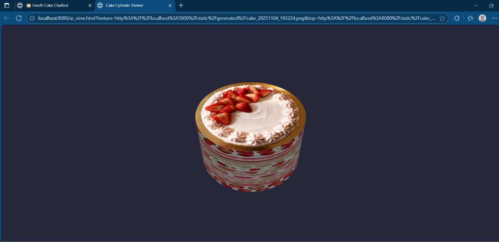

# CakeVision – AI Powered 3D Cake Generator 🎂

CakeVision is a generative AI application that converts natural language cake descriptions into realistic cake textures and renders them on a 3D cake model in real time.

The system integrates Stable Diffusion XL for image generation and Babylon.js for 3D visualization, enabling users to design and visualize custom cakes interactively.

## 📸 Preview

### Cake Generation Interface

### Generated 3D Cake Rendering

## 🚀 Demo

Live Demo: https://drive.google.com/file/d/1G4wuD4ZlkVSVarF4syMA3q6OeDn4elLg/view

### Example Prompt
"chocolate cake with strawberry chocolate side frosting"

### Output
- AI-generated cake texture
- Real-time 3D rendered cake model

## 🧠 How It Works
1. User enters a cake description.
2. AI generates cake texture using Stability API.
3. Babylon.js renders a real-time 3D cake model.

## ✨ Features
• AI-based cake texture generation using Stable Diffusion XL
• Natural language cake description input
• Automatic prompt optimization for seamless texture generation
• Real-time 3D cake rendering using Babylon.js
• Browser-based AR cake visualization using WebXR
• REST API backend built with Flask
• Dynamic texture mapping on 3D models

## System Architecture 

User Prompt (Frontend UI)
        ↓
Flask REST API (/generate)
        ↓
Prompt Optimization + Side Texture Hint
        ↓
Stable Diffusion XL API
        ↓
Base64 Image Response
        ↓
Decode + Store Generated Texture
        ↓
Babylon.js 3D Viewer
        ↓
Textured Cake Model Rendering

## 🛠 Tech Stack

Backend
• Python
• Flask
• PyTorch
• MiDaS

Frontend
• HTML
• JavaScript
• Babylon.js

AI
• Stable Diffusion XL

## 📦 Installation

1. Clone the repository

git clone https://github.com/801NITHU2213/CakeVision-AI-Powered-3D-Cake-Generator

2. Install dependencies

pip install -r requirements.txt

3. Add your Stability API key

Create a .env file:

STABILITY_API_KEY=your_api_key

4. Run the backend

python app.py

5. Open index.html in a browser
## 📁 Project Structure

CakeVision-AI-Powered-3D-Cake-Generator
│
├── app.py
├── requirements.txt
├── index.html
├── ar_view.html
├── assets
│   ├── preview.png
│   └── preview1.png
└── README.md

## 🚀 Future Improvements

• Support multi-tier cake geometry generation  
• Add high-resolution texture generation  
• Deploy the application using Docker and cloud GPU  
• Add drag-and-drop cake customization UI  
